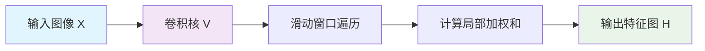

# 卷积神经网络：从全连接层到卷积神经网络

在深度学习的浪潮中，卷积神经网络（Convolutional Neural Networks, CNN）无疑是计算机视觉领域的基石。它让机器“看懂”世界成为可能，从人脸识别到自动驾驶，其应用无处不在。但你是否想过，为什么是“卷积”？为什么我们不直接使用理论上“万能”的全连接网络来处理图像？本文将带你从全连接层的局限出发，一步步推导出卷积神经网络的核心思想与数学本质。

## 全连接层的“力不从心”

多层感知机（MLP）及其核心组件——**全连接层**（Fully Connected Layer）——是处理表格数据的利器。在全连接层中，前一层的每一个神经元都与后一层的每一个神经元相连接，形成了一个密集的网络。

:::note
什么是全连接层？
前一层的每一个神经元都与后一层的每一个神经元相连接。多层感知机的主体就是全连接层，而用于图像分类的卷积神经网络的最后几层也通常由全连接层构成，负责将学习到的高级特征映射到最终的分类结果上。
:::

从理论上讲，全连接层非常强大。在不考虑计算资源限制的情况下，它能够以任意精度逼近任何连续函数。这意味着，理论上，图像分类、目标检测等视觉任务也**可以**通过堆叠足够多的全连接层来实现。

然而，“可以”不等于“合适”。当我们将全连接层应用于图像这种**网格结构数据**时，其缺点暴露无遗：

1.  **极其低效与浪费**：假设我们有一张 100x100 像素的灰度图（输入维度为 10,000）。如果下一隐藏层也有 10,000 个神经元，那么仅这一层就需要 **1亿（10,000 * 10,000）个权重参数**！这带来了巨大的计算和存储开销。
2.  **破坏空间结构**：图像中相邻像素之间具有强烈的空间相关性。全连接层将每个像素视为独立的特征，完全忽略了这种宝贵的局部结构信息。
3.  **极易过拟合**：海量的参数需要海量的数据来训练，否则模型只会记住训练样本的噪声，而无法泛化到新数据。

简而言之，全连接层处理图像就像用一把大锤去绣花——力量有余，但精巧不足。它不会“抓重点”，只会用“笨方法”堆砌算力。

## 计算机视觉的两大设计原则

为了更高效、更智能地处理图像，我们需要一种新的网络架构。它应该遵循计算机视觉任务的两个内在特性：

### 1. 平移不变性 (Translation Invariance)
无论一只猫出现在图像的左上角还是右下角，它都是一只猫。因此，神经网络的前面几层应该对图像中相同模式的区域做出相似的反应，而不应过分依赖于该模式出现的位置。这种特性称为“平移不变性”。

### 2. 局部性 (Locality)
图像中的物体通常由局部的基本特征（如边缘、角点、纹理）构成。神经网络的前面几层应该主要探索输入图像的**局部区域**，关注邻近像素之间的关系，而不是一开始就试图建立图像两端像素的遥远联系。这就是“局部性”原则。网络可以后续再聚合这些局部特征，形成对整个图像的全局理解。

## 从数学公式到卷积层

让我们看看如何将这两个原则融入数学框架。首先，回顾一下多层感知机中一个隐藏单元的计算方式（为了简化，我们以二维图像为例）：

假设输入是二维张量 $\mathbf{X}$，隐藏表示是 $\mathbf{H}$。在传统全连接层中，隐藏单元 $[\mathbf{H}]_{i, j}$ 的计算涉及所有输入像素：

$$
\begin{aligned}
[\mathbf{H}]_{i, j} &= [\mathbf{U}]_{i, j} + \sum_k \sum_l [\mathsf{W}]_{i, j, k, l} [\mathbf{X}]_{k, l} \\
&= [\mathbf{U}]_{i, j} + \sum_a \sum_b [\mathsf{V}]_{i, j, a, b} [\mathbf{X}]_{i+a, j+b}.
\end{aligned}
$$

这里，权重 $\mathsf{W}$ 是一个四维张量，参数数量极其庞大。我们通过变量替换（令 $a = k-i, b = l-j$）得到了第二个等式，将权重重新参数化为 $\mathsf{V}$，其索引 $(a, b)$ 表示相对于中心位置 $(i, j)$ 的偏移。

现在，我们引入第一个原则——**平移不变性**。

这意味着偏差 $U$ 和权重 $V$ 不应该依赖于隐藏单元的位置 $(i, j)$。无论我们计算图像哪个位置的隐藏单元，都应该使用相同的权重和偏差。因此，$[\mathbf{U}]_{i, j}$ 退化为一个标量 $u$，$[\mathsf{V}]_{i, j, a, b}$ 退化为一个二维张量 $[\mathbf{V}]_{a, b}$。公式简化为：

$$
[\mathbf{H}]_{i, j} = u + \sum_a \sum_b [\mathbf{V}]_{a, b} [\mathbf{X}]_{i+a, j+b}.
$$

这已经是一个巨大的进步！参数从依赖于位置的四维张量，减少到了全局共享的二维张量（卷积核）和一个标量偏差。

接下来，引入第二个原则——**局部性**。

在图像中，一个像素点通常只与其周围邻近的像素有强关联。因此，我们没有必要让 $[\mathbf{H}]_{i, j}$ 的计算依赖于距离 $(i, j)$ 很远的 $[\mathbf{X}]_{i+a, j+b}$。我们可以对偏移量 $(a, b)$ 的取值范围进行限制。设定一个局部窗口大小 $\Delta$，规定 $a$ 和 $b$ 只能在 $[-\Delta, \Delta]$ 的范围内取值。对于窗口外的区域，我们直接将权重 $[\mathbf{V}]_{a, b}$ 设为 0。于是公式变为：

$$
[\mathbf{H}]_{i, j} = u + \sum_{a = -\Delta}^{\Delta} \sum_{b = -\Delta}^{\Delta} [\mathbf{V}]_{a, b} [\mathbf{X}]_{i+a, j+b}.
$$

**恭喜！** 这个公式正是**卷积层（Convolutional Layer）** 的严格数学定义。而卷积神经网络，就是由多个这样的卷积层（通常还穿插着池化层、激活函数等）构成的一类特殊神经网络。

在深度学习中，我们称 $\mathbf{V}$ 为**卷积核（Convolution Kernel）**、**滤波器（Filter）** 或**权重**，它是模型需要学习的关键参数。偏差 $u$ 通常也是一个可学习的标量（在实践中，每个卷积核会有一个独立的偏差）。

:::tip[参数效率的飞跃]
当局部窗口 $\Delta$ 较小时（例如 3x3 或 5x5），卷积层的参数量相比全连接层实现了数量级的下降。以前，处理一张小图片可能需要全连接层数十亿的参数，而现在一个卷积层可能只需要几百个参数。这不仅极大地降低了计算和存储成本，也有效缓解了过拟合问题。
:::

代价是，我们做出的两个假设：特征具有**平移不变性**，且每一层在生成特征时只关注**局部信息**。幸运的是，对于大多数视觉任务，这两个假设是合理且有益的。

## “卷积”之名从何而来？

我们一直说“卷积层”，那么它和数学中的“卷积”运算有什么关系呢？

在数学（特别是泛函分析）中，两个函数 $f$ 和 $g$ 之间的卷积定义为：

$$
(f * g)(\mathbf{x}) = \int f(\mathbf{z}) g(\mathbf{x}-\mathbf{z}) d\mathbf{z}.
$$

直观理解，卷积衡量了当一个函数“翻转”并平移 $\mathbf{x}$ 后，与另一个函数的重叠面积。对于离散对象（如我们的像素值），积分就变成了求和：

$$
(f * g)(i) = \sum_a f(a) g(i-a).
$$

将其扩展到二维，正是我们之前得到的公式形式：

$$
(f * g)(i, j) = \sum_a \sum_b f(a, b) g(i-a, j-b).
$$

仔细观察并与我们的卷积层公式 $[\mathbf{H}]_{i, j} = u + \sum_{a} \sum_{b} [\mathbf{V}]_{a, b} [\mathbf{X}]_{i+a, j+b}$ 对比，你会发现它们非常相似，主要区别在于索引的符号（$i-a$ vs $i+a$）和是否包含翻转。

在深度学习领域，我们通常使用**互相关（Cross-correlation）** 运算，它省去了数学卷积中“翻转核”的步骤。但根据惯例，我们依然称之为“卷积”。这种操作的本质是在输入数据上**滑动一个固定的权重窗口（卷积核）**，并在每个位置计算窗口内数据的加权和。

下面的 Mermaid 流程图直观展示了这一过程：

## 总结：从原则到实践

我们从全连接层在处理图像时的困境出发，引出了设计视觉网络架构的两大核心原则：**平移不变性**和**局部性**。通过将这两条原则转化为对全连接层数学公式的约束，我们自然而然地推导出了**卷积层**的数学表达式。

这种转变带来了革命性的优势：
*   **参数共享**：一个卷积核在整个图像上滑动使用，极大地减少了参数量。
*   **局部连接**：每个神经元只与输入的一个小区域连接，保留了空间结构。
*   **层次化特征提取**：浅层卷积核学习边缘、颜色等低级特征，深层卷积核则组合这些低级特征，形成纹理、部件乃至整个物体的高级特征。

正是这些特性，使得卷积神经网络成为处理图像、语音、甚至文本等具有网格或序列结构数据的强大工具。在接下来的文章中，我们将深入探讨卷积层的具体实现、常见的CNN架构（如LeNet, AlexNet, VGG, ResNet）以及如何在PyTorch中轻松使用它们。

理解从全连接层到卷积层的这一思想飞跃，是掌握现代深度学习，特别是计算机视觉领域的关键第一步。