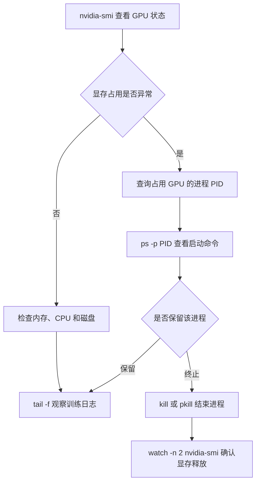

# 使用 Linux 服务器的一些常用命令

在 GPU 服务器上做训练、跑实验或排查问题时，高频命令通常集中在进程、显存、磁盘、日志和终端会话几个方向。本文按实战场景整理常用命令，假设你通过 SSH 连接 Ubuntu/Debian 服务器，并且大部分操作不需要 sudo。

## 一、ps — 查看进程

`ps` 是排查“这个训练还在不在跑”“谁占了资源”的基础命令。

```bash
# 查看某个进程是否还在，以及运行了多久
ps -p 41821 -o pid,etime,cmd
# 示例输出：
# PID     ELAPSED       CMD
# 41821   03:12:45      python train.py --batch_size 64
```

常用字段解释：

- `pid`：进程 ID
- `etime`：进程运行时长，例如 `03:12:45`
- `cmd`：启动该进程的完整命令
- `%cpu`：CPU 使用率
- `%mem`：内存使用率
- `user`：进程所属用户

```bash
# 查看所有 python 相关进程
ps aux | grep '[p]ython'

# 查看谁在占用 GPU，配合 nvidia-smi 的 PID 使用
nvidia-smi
ps -p <PID> -o pid,user,etime,cmd

# 按内存占用排序，快速找到吃内存的进程
ps -eo pid,user,%cpu,%mem,etime,cmd --sort=-%mem | head -10
```

:::tip  
`grep '[p]ython'` 的小技巧可以避免 grep 自身也出现在结果里。  
:::

如果还想看进程的父进程关系，可以使用：

```bash
pstree -p 41821
```

## 二、nvidia-smi — GPU 状态

GPU 服务器上最常用的命令就是 `nvidia-smi`。

```bash
# 基础：查看显存、GPU 利用率、温度、进程等
nvidia-smi

# 每 2 秒实时刷新，适合观察训练时资源变化
watch -n 2 nvidia-smi
# 按 Ctrl+C 退出
```

如果你只需要看几个关键指标，可以用 `--query-gpu` 输出精简表格：

```bash
# 查看显存占用、显存总量、GPU 利用率、温度
nvidia-smi \
  --query-gpu=memory.used,memory.total,utilization.gpu,temperature.gpu \
  --format=csv
```

示例输出大致如下：

```text
memory.used [MiB], memory.total [MiB], utilization.gpu [%], temperature.gpu
24576, 81920, 98, 62
```

如果想找哪些进程正在使用显卡显存：

```bash
# 查看占用 GPU 显存的进程
nvidia-smi --query-compute-apps=pid,used_memory --format=csv
```

拿到 PID 后，再回到 `ps` 查看它对应的脚本：

```bash
ps -p <PID> -o pid,user,etime,cmd
```

:::tip  
当 GPU 显示占用很高，但你不确定是谁在跑时，标准排查顺序是：  
`nvidia-smi` → 找到 PID → `ps -p PID` → 看脚本名和启动命令。  
:::

## 三、磁盘空间

训练数据、checkpoint 和日志很容易占满磁盘。下面命令可以帮你定位空间被谁吃掉。

```bash
# 查看各个磁盘分区的剩余空间
df -h
# -h 表示使用人类可读单位，例如 100G、512M
```

`df` 看的是整个文件系统，而 `du` 看的是某个目录实际占用。

```bash
# 查看当前目录总共占多大
du -sh .

# 查看当前目录下各子目录大小，并按大小降序排列
du -sh */ | sort -rh | head -10

# 查看训练输出目录占了多少空间
du -sh /data/advance/runs_v2/* 2>/dev/null
```

找大文件可以用 `find`：

```bash
# 查找大于 1G 的文件，并显示大小
find /data -type f -size +1G -exec ls -lh {} \;
```

如果觉得上面的命令比较慢，也可以用 `-printf` 输出更轻量：

```bash
# 查找 /data 下大于 1G 的文件，按大小降序输出
find /data -type f -size +1G -printf '%s %p\n' | sort -rn | head -20
```

:::tip  
如果服务器允许安装软件，可以试试 `ncdu`，交互式查看目录体积会更直观：  
```bash
ncdu /data
```
:::

## 四、tmux — 终端复用

远程训练最怕 SSH 断开导致进程被杀。`tmux` 可以创建一个独立于 SSH 连接的会话，即使断开连接，训练仍会继续运行。

```bash
# 创建名为 train 的会话
tmux new -s train

# 列出所有会话
tmux ls

# 接入 train 会话
tmux a -t train

# 删除 train 会话
tmux kill-session -t train
```

会话内部的快捷键需要先按 `Ctrl+b`，松开后再按第二个键。常用快捷键如下：

| 快捷键 | 作用 |
| --- | --- |
| `Ctrl+b d` | 脱离当前会话，进程继续运行 |
| `Ctrl+b [` | 进入滚屏模式，按 `q` 退出 |
| `Ctrl+b c` | 新建窗口 |
| `Ctrl+b n` / `Ctrl+b p` | 下一个 / 上一个窗口 |
| `Ctrl+b %` | 左右分屏 |
| `Ctrl+b "` | 上下分屏 |
| `Ctrl+b 方向键` | 切换窗格 |
| `Ctrl+b x` | 关闭当前窗格 |
| `Ctrl+b z` | 当前窗格全屏 / 还原 |

:::important  
跑长时间训练时，务必把任务放进 `tmux` 或 `nohup` 中。普通 SSH 会话一旦断开，前台任务会被终止。  
:::

## 五、监控与日志

### 内存与 CPU

```bash
# 查看系统内存
free -h

# 查看 CPU、内存、负载
top

# 更友好的进程管理器
htop
# 如果没有 ht op，可尝试：sudo apt install htop
```

`top` 中需要关注的重点：

- `load average`：系统负载，例如 `4.50, 5.10, 4.80`
- `%CPU`：进程 CPU 占用
- `%MEM`：进程内存占用
- `RES`：进程实际使用的物理内存

### 终止进程

```bash
# 温柔终止进程，默认发送 SIGTERM
kill <PID>

# 强制终止进程，只有普通 kill 无效时再使用
kill -9 <PID>

# 按启动命令名批量终止
pkill -f improve.py
```

使用 `pkill -f` 前最好先确认会匹配到哪些进程：

```bash
pgrep -af improve.py
```

### 查看日志

```bash
# 实时跟进日志
tail -f train.log

# 查看日志最后 50 行
tail -n 50 train.log

# 查看日志前 20 行
head -n 20 train.log
```

如果日志文件可能被轮转替换，使用 `tail -F` 会更可靠：

```bash
tail -F train.log
```

## 六、文件传输与远程操作

在本地和服务器之间传模型权重、数据集和结果时，常用 `scp` 与 `rsync`。

```bash
# 上传本地文件到服务器
scp ./local_model.pth user@server:/data/models/

# 从服务器下载文件到本地
scp user@server:/data/runs/exp1/results.csv ./results.csv

# 大目录或需要断点续传时，使用 rsync 增量同步
rsync -avP ./runs_v2/ user@server:/data/advance/runs_v2/

# 从服务器同步结果到本地
rsync -avP user@server:/data/runs_v2/results/ ./results/
```

`rsync` 参数说明：

- `-a`：归档模式，保留权限、时间戳等
- `-v`：显示详细信息
- `-P`：显示进度，并支持断点续传

如果 SSH 端口不是默认的 22，需要额外指定端口：

```bash
# scp 指定端口
scp -P 2222 ./file.txt user@server:/data/

# rsync 指定端口
rsync -avP -e 'ssh -p 2222' ./results/ user@server:/data/results/
```

:::note  
`scp` 使用大写 `-P`，`rsync` 使用小写 `-p`/`-P` 有不同的含义，注意区分。  
:::

## 七、后台任务：nohup

如果暂时不想使用 `tmux`，也可以使用 `nohup` 把任务放到后台。

```bash
# 在后台启动训练，输出写入 train.log
nohup python train.py > train.log 2>&1 &
```

各个部分含义：

- `nohup`：忽略挂断信号，SSH 断开后任务继续运行
- `> train.log`：标准输出写入 `train.log`
- `2>&1`：标准错误也写入 `train.log`
- `&`：后台运行

记录进程 ID 方便后续管理：

```bash
# 将后台进程 PID 写入文件
echo $! > train.pid

# 实时查看日志
tail -f train.log

# 根据 PID 结束训练
kill "$(cat train.pid)"
```

## 八、综合排查流程

当 GPU 卡顿、显存被占满或训练没有输出时，可以按下面流程快速定位。



实际排查时，通常只需要几条命令：

```bash
# 1. 看所有 GPU 进程
nvidia-smi --query-compute-apps=pid,used_memory --format=csv

# 2. 根据 PID 查看启动命令
ps -p 12345 -o pid,user,etime,cmd

# 3. 如果确认是残留任务，结束进程
kill 12345

# 4. 观察 GPU 是否释放
watch -n 2 nvidia-smi
```

这些命令覆盖了日常训练中最高频的场景。熟练掌握后，大部分服务器问题都可以在几分钟内定位清楚。