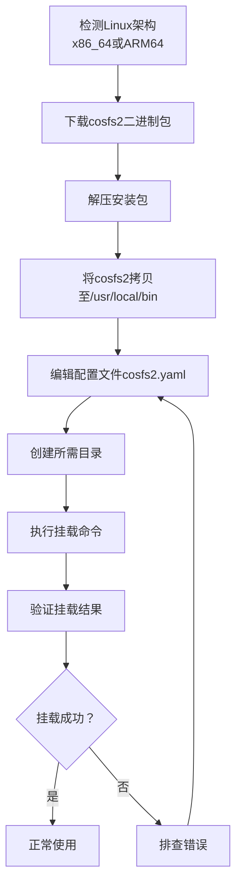

## 写在前面

腾讯云对象存储（COS）提供了海量、安全、低成本的云端存储能力，但在某些场景下，我们更希望像操作本地文件系统一样直接读写存储桶中的文件。`cosfs2` 正是为此而生——它基于 FUSE，可以将一个 COS 存储桶挂载为一个本地目录，让 Linux 服务器上的应用像访问本地文件一样访问云端对象。

本教程将带你完成从安装到卸载的完整流程，全程使用命令行操作。无论你是需要为 Web 应用提供动态存储，还是想快速迁移数据，都能轻松上手。

整个工作流大致如下：



## 1. 安装 cosfs2

首先需要根据你 Linux 服务器的 CPU 架构下载对应的二进制包。官方提供了 `x86_64` 和 `ARM64` 两个版本，通过自动获取最新版本文件名的方式，可以省去手动查找的麻烦。

### x86_64 架构

```bash
filename=$(curl -s https://cosfs2-1253960454.cos.ap-guangzhou.myqcloud.com/software/cosfs2/release/cosfs2-linux-amd64/latest.txt)
wget "https://cosfs2-1253960454.cos.ap-guangzhou.myqcloud.com/software/cosfs2/release/cosfs2-linux-amd64/${filename}"
```

### ARM64 架构

```bash
filename=$(curl -s https://cosfs2-1253960454.cos.ap-guangzhou.myqcloud.com/software/cosfs2/release/cosfs2-linux-arm64/latest.txt)
wget "https://cosfs2-1253960454.cos.ap-guangzhou.myqcloud.com/software/cosfs2/release/cosfs2-linux-arm64/${filename}"
```

> [!TIP]
> 如果你不确定当前系统的架构，可以通过 `uname -m` 快速查看。输出为 `x86_64` 则选择第一个命令，`aarch64` 则选择第二个。

下载完成后，当前目录下会出现一个形如 `cosfs2-1.1.0.81-linux-amd64.tar.gz`（实际版本号可能更新）的压缩包。

## 2. 解压安装包

使用 `tar` 解压刚刚下载的文件。由于文件名已保存在 `$filename` 变量中，可以直接引用：

```bash
tar -xvzf "$filename"
tar -zxvf cosfs2-1.1.0.81.tar.gz#或者直接使用文件名
```

解压后会生成一个同名目录（去除 `.tar.gz` 后缀），比如 `cosfs2-1.1.0.81-linux-amd64`。我们先通过 `ls` 确认一下目录名，然后进入该目录：

```bash
ls -l
cd cosfs2-1.1.0.81-linux-amd64   # 请根据实际目录名修改
```

## 3. 查看目录内容并移动可执行文件

进入目录后，查看里面的文件：

```bash
ls -l
```

你会看到一个名为 `cosfs2` 的二进制可执行文件，以及 `conf` 配置目录等。为了让 `cosfs2` 命令能在系统的任何位置直接调用，我们将其拷贝到环境变量路径中，并赋予可执行权限：

```bash
sudo cp cosfs2 /usr/local/bin/
sudo chmod +x /usr/local/bin/cosfs2
```

## 4. 验证安装

执行以下命令检查版本号，确认安装无误：

```bash
cosfs2 --version
```

如果屏幕打印出类似 `cosfs2 version: 1.1.0.81` 的信息，说明安装成功。

## 5. 编辑配置文件

`cosfs2` 的所有运行参数都通过一个 YAML 文件管理。我们可以直接编辑解压目录下的 `conf/cosfs2.yaml`（如果当前已位于解压后的目录，则路径为 `conf/cosfs2.yaml`）。

打开文件并填入如下内容（请务必替换其中的 `secret-id` 和 `secret-key` 为你自己的腾讯云 API 密钥）：

```yaml
app-name: "cosfs2"
cos:
  secret-id: "your-secret-id"
  secret-key: "your-secret-key"
logging:
  file-path: "/data/cosfs2-1.1.0.81/logs/cosfs2.log"  # 日志存放目录
  format: text                          # 类型为文本
  severity: info                        # 记录级别，可改为 error
  max-size-mb: 100                      # 单个日志文件最大 100 MB
  max-age: 7                            # 最多保留 7 天
file-cache:
  cache-dir: "/data/cosfs2-1.1.0.81/file-cache"  # 缓存目录
  max-size-mb: 1024                     # 缓存最大 1 GB（根据需求调整）
file-system:
  temp-dir: "/data/cosfs2-1.1.0.81/temp"         # 临时文件目录
  file-options: "allow_other"           # 允许其他用户读写
foreground: false                       # 后台守护进程运行
```

> [!IMPORTANT]
> 密钥信息非常敏感，请妥善保管此配置文件，不要上传到公开仓库。建议将文件权限设置为 `600`：  
> `sudo chmod 600 conf/cosfs2.yaml`

- **日志** 可以帮助排查挂载异常或访问错误，`severity` 可设为 `info` 记录全部信息，生产环境若追求安静可以改为 `error`。
- **缓存** 用于加速读写，`cosfs2` 会将频繁访问的文件暂存到本地，避免每次都从 COS 拉取，提升使用体验。
- **`file-options: "allow_other"`** 允许服务器上其他用户访问挂载点，适合多用户协作的场景。

## 6. 创建所需目录

配置文件里指定的日志、缓存、临时目录不会自动创建，我们需要手动建立。注意目录路径中包含版本号，请保持与你实际使用的版本一致（例如示例中为 `1.1.0.81`）。

```bash
sudo mkdir -p /data/cosfs2-1.1.0.81/logs
sudo mkdir -p /data/cosfs2-1.1.0.81/file-cache
sudo mkdir -p /data/cosfs2-1.1.0.81/temp
```

建议使用 `-p` 参数一次性创建父级目录，省时省力。

## 7. 挂载存储桶

万事俱备，现在可以执行挂载命令。基本格式为：

```
cosfs2 --config-file=[配置文件绝对路径] cos://[存储桶名称]-[APPID].[COS区域].myqcloud.com [本地挂载点目录路径]
```

具体示例（请根据实际情况修改）：

```bash
cosfs2 --config-file=/home/ubuntu/cosfs2-1.1.0.81/conf/cosfs2.yaml \
cos://example-1234567890.cos.ap-guangzhou.myqcloud.com /www/mycos
```

- `--config-file`：填写上一步配置文件的完整绝对路径。
- 桶地址：格式为 `[BucketName]-[APPID].[Region].myqcloud.com`，例如 `myfiles-1250000000.cos.ap-shanghai.myqcloud.com`。
- 最后一个参数是本地挂载点目录，请确保该目录已经存在（使用 `sudo mkdir -p /www/mycos` 创建）。

如果执行后没有任何错误输出，说明挂载操作已经完成。

### 验证挂载

你可以用两种方式快速验证：

```bash
# 查看磁盘挂载列表中是否出现 cosfs2 或 fuse 类型的条目
df -h

# 查看本地挂载点目录下是否正确显示了桶内的文件
ls -la /www/mycos
```

若列表中出现了对应的文件系统，同时 `ls` 能列出云端存储桶内的对象，说明挂载彻底成功。

## 8. 卸载存储桶

不再需要挂载时，务必使用 `umount` 命令正确卸载，**切勿直接使用 `rm -rf` 删除挂载目录，否则可能误删云端数据！**

标准卸载方式：

```bash
sudo umount /www/mycos         # 你的挂载点路径
```

如果提示设备忙，可以尝试以下两种方式：

- 强行断开（可能导致数据不完整，谨慎使用）：  
  `sudo umount -f /www/mycos`
- 安全延迟卸载（等待不再使用时自动断开）：  
  `sudo umount -l /www/mycos`

卸载后，本地目录将恢复为普通空目录，云端数据不受任何影响。

## 9. 其他常用命令速查

| 命令          | 用途                                 |
| ------------- | ------------------------------------ |
| `df -h`       | 查看文件系统挂载列表，确认 COS 桶是否挂载   |
| `ls -la`      | 检查本地挂载目录中的文件，验证云端数据      |
| `cosfs2 --version` | 查看 cosfs2 版本                     |

> [!NOTE]
> 若挂载失败，常见原因包括：密钥错误、桶名称或区域拼写错误、本地挂载点目录不存在、网络不通等。请仔细检查配置文件和网络状况。